# Documentação do Autômato Finito Determinístico (AFD) — MiniLang

Esta documentação descreve formalmente o **Analisador Léxico (Scanner)** da linguagem **MiniLang** (Marco M1), detalhando:
1. As **expressões regulares (ER)** de cada categoria de token;
2. O **diagrama de estados do AFD** em notação Mermaid;
3. A **tabela de transições de estados** do autômato;
4. As regras de descarte (espaços em branco e comentários) e tratamento de erros.

---

## 1. Expressões Regulares de Cada Token

### 1.1. Definições Regulares Auxiliares

$$\text{dígito} \to [0\text{-}9]$$
$$\text{letra} \to [a\text{-}zA\text{-}ZáàâãéêíóôõúçÁÀÂÃÉÊÍÓÔÕÚÇ]$$
$$\text{sublinhado} \to \_$$
$$\text{letra\_ou\_sublinhado} \to \text{letra} \mid \text{sublinhado}$$
$$\text{caractere\_ident} \to \text{letra} \mid \text{dígito} \mid \text{sublinhado}$$
$$\text{espaço\_em\_branco} \to [\ \backslash t\backslash r\backslash n]$$
$$\text{comentário} \to \#[\text{^\backslash n}]*$$

---

### 1.2. Expressões Regulares por Categoria Léxica

| Categoria | Token (`TokenType`) | Expressão Regular | Descrição / Exemplos |
|---|---|---|---|
| **Palavras Reservadas** | `PROGRAMA` | `programa` | Início do programa |
| | `VAR` | `var` | Seção de declaração de variáveis |
| | `INTEIRO` | `inteiro` | Tipo primitivo inteiro |
| | `BOOLEANO` | `booleano` | Tipo primitivo booleano |
| | `SE` | `se` | Condicional simples |
| | `SENAO` | `senão` $\mid$ `senao` | Ramo alternativo da condicional |
| | `ENQUANTO` | `enquanto` | Laço condicional |
| | `ESCREVA` | `escreva` | Primitiva de saída padrão |
| | `LEIA` | `leia` | Primitiva de entrada padrão |
| | `VERDADEIRO` | `verdadeiro` | Literal booleano verdadeiro |
| | `FALSO` | `falso` | Literal booleano falso |
| | `E` | `e` | Operador lógico de conjunção |
| | `OU` | `ou` | Operador lógico de disjunção |
| | `NAO` | `não` $\mid$ `nao` | Operador lógico de negação |
| | `FIM` | `fim` | Fim do bloco principal |
| **Extensão D** | `PARA` | `para` | Início do laço determinado |
| | `ATE` | `ate` $\mid$ `até` | Limite do laço para/repita |
| | `PASSO` | `passo` | Incremento opcional do laço |
| | `REPITA` | `repita` | Início do laço pós-testado |
| **Identificadores** | `IDENT` | $\text{letra\_ou\_sublinhado} \cdot (\text{caractere\_ident})^*$ | Nomes de variáveis e funções (ex.: `x`, `soma1`, `_contador`) |
| **Literais Inteiros** | `NUM_INT` | $\text{dígito}^+$ | Sequência de dígitos decimais (ex.: `0`, `42`, `1000`) |
| **Operadores Aritméticos** | `MAIS` | `+` | Adição |
| | `MENOS` | `-` | Subtração |
| | `MULT` | `*` | Multiplicação |
| | `DIV` | `/` | Divisão inteira |
| | `MOD` | `%` | Resto da divisão inteira |
| **Operadores Relacionais** | `IGUAL` | `==` | Comparação de igualdade |
| | `DIFERENTE` | `!=` | Comparação de diferença |
| | `MENOR` | `<` | Estritamente menor que |
| | `MENOR_IGUAL` | `<=` | Menor ou igual |
| | `MAIOR` | `>` | Estritamente maior que |
| | `MAIOR_IGUAL` | `>=` | Maior ou igual |
| **Atribuição** | `ATRIB` | `=` | Atribuição de valor |
| **Delimitadores** | `ABRE_PAR` | `(` | Abre parênteses |
| | `FECHA_PAR` | `)` | Fecha parênteses |
| | `ABRE_CHAVE` | `{` | Abre bloco de comandos |
| | `FECHA_CHAVE` | `}` | Fecha bloco de comandos |
| | `PONTO_VIRGULA` | `;` | Separador de instruções |
| | `DOIS_PONTOS` | `:` | Declaração de tipo |
| | `VIRGULA` | `,` | Separador de itens/variáveis |
| | `PONTO` | `.` | Ponto finalizador do programa (`fim.`) |
| **Fim de Arquivo** | `EOF` | `\0` / Fim do fluxo | Fim da cadeia de entrada |

---

## 2. Diagrama de Estados do AFD (Mermaid)

O diagrama a seguir modela o comportamento determinístico da varredura léxica:

```mermaid
stateDiagram-v2
    direction TB

    [*] --> S0

    %% Ignorados
    S0 --> S0: espaco / \t / \r / \n
    S0 --> S_COMENT: '#'
    S_COMENT --> S_COMENT: [^\n]
    S_COMENT --> S0: \n

    %% Identificadores e Palavras Reservadas
    S0 --> S_IDENT: letra ou '_'
    S_IDENT --> S_IDENT: letra, dígito ou '_'
    S_IDENT --> [*]: outro [lookup PALAVRAS_RESERVADAS]

    %% Literais Inteiros
    S0 --> S_NUM: dígito
    S_NUM --> S_NUM: dígito
    S_NUM --> [*]: outro [NUM_INT]

    %% Lookahead: Atribuição ou Igual
    S0 --> S_EQ: '='
    S_EQ --> S_IGUAL: '='
    S_EQ --> [*]: outro [ATRIB]
    S_IGUAL --> [*]: [IGUAL]

    %% Lookahead: Diferente ou Erro de '!'
    S0 --> S_EXCL: '!'
    S_EXCL --> S_DIF: '='
    S_EXCL --> S_ERRO: outro [Erro léxico: ! solto]
    S_DIF --> [*]: [DIFERENTE]

    %% Lookahead: Menor ou Menor-Igual
    S0 --> S_LT: '<'
    S_LT --> S_LE: '='
    S_LT --> [*]: outro [MENOR]
    S_LE --> [*]: [MENOR_IGUAL]

    %% Lookahead: Maior ou Maior-Igual
    S0 --> S_GT: '>'
    S_GT --> S_GE: '='
    S_GT --> [*]: outro [MAIOR]
    S_GE --> [*]: [MAIOR_IGUAL]

    %% Operadores de 1 Caractere
    S0 --> S_MAIS: '+'
    S0 --> S_MENOS: '-'
    S0 --> S_MULT: '*'
    S0 --> S_DIV: '/'
    S0 --> S_MOD: '%'

    %% Delimitadores
    S0 --> S_APAR: '('
    S0 --> S_FPAR: ')'
    S0 --> S_ACHAVE: '{'
    S0 --> S_FCHAVE: '}'
    S0 --> S_PVIRG: ';'
    S0 --> S_DPONT: ':'
    S0 --> S_VIRG: ','
    S0 --> S_PONTO: '.'

    %% Fim de Arquivo e Erros
    S0 --> S_EOF: EOF
    S0 --> S_ERRO: caractere inválido

    %% Estados Finais
    S_MAIS --> [*]: [MAIS]
    S_MENOS --> [*]: [MENOS]
    S_MULT --> [*]: [MULT]
    S_DIV --> [*]: [DIV]
    S_MOD --> [*]: [MOD]
    S_APAR --> [*]: [ABRE_PAR]
    S_FPAR --> [*]: [FECHA_PAR]
    S_ACHAVE --> [*]: [ABRE_CHAVE]
    S_FCHAVE --> [*]: [FECHA_CHAVE]
    S_PVIRG --> [*]: [PONTO_VIRGULA]
    S_DPONT --> [*]: [DOIS_PONTOS]
    S_VIRG --> [*]: [VIRGULA]
    S_PONTO --> [*]: [PONTO]
    S_EOF --> [*]: [EOF]
    S_ERRO --> [*]: [Reporta Erro e Recupera]
```

---

## 3. Tabela de Transições de Estados

Na tabela:
- **`[Recuar]`**: Indica que o caractere lido não pertence ao token atual e é devolvido ao fluxo (lookahead sem consumo).
- **`[Aceita: TOKEN]`**: Estado de aceitação emitindo o token indicado.
- **`[Erro]`**: Reporta erro léxico com linha e coluna e continua a leitura do próximo caractere (recuperação em modo pânico unitário).

| Estado Atual | Entrada | Próximo Estado | Ação Semântica / Emissão de Token |
|---|---|---|---|
| **$S_0$ (Inicial)** | ` `, `\t`, `\r` | $S_0$ | Incrementa coluna |
| | `\n` | $S_0$ | Incrementa linha, coluna $\leftarrow$ 1 |
| | `#` | $S_{\text{coment}}$ | Consome início do comentário |
| | `a-z`, `A-Z`, `_`, acentos | $S_{\text{ident}}$ | Inicia identificador/palavra reservada |
| | `0-9` | $S_{\text{num}}$ | Inicia número inteiro |
| | `=` | $S_{=}$ | Lookahead de 1 caractere |
| | `!` | $S_{!}$ | Lookahead de 1 caractere |
| | `<` | $S_{<}$ | Lookahead de 1 caractere |
| | `>` | $S_{>}$ | Lookahead de 1 caractere |
| | `+`, `-`, `*`, `/`, `%` | Final imediato | Aceita: `MAIS`, `MENOS`, `MULT`, `DIV`, `MOD` |
| | `(`, `)`, `{`, `}` | Final imediato | Aceita: `ABRE_PAR`, `FECHA_PAR`, `ABRE_CHAVE`, `FECHA_CHAVE` |
| | `;`, `:`, `,`, `.` | Final imediato | Aceita: `PONTO_VIRGULA`, `DOIS_PONTOS`, `VIRGULA`, `PONTO` |
| | `EOF` | $S_{\text{eof}}$ | Aceita: `EOF` |
| | Outro caractere (ex.: `@`, `$`) | $S_{\text{erro}}$ | `[Erro]` caractere inesperado; avança caractere |
| **$S_{\text{coment}}$** | `[^\n]` | $S_{\text{coment}}$ | Consome caractere do comentário |
| | `\n` | $S_0$ | Quebra de linha encerra comentário |
| | `EOF` | $S_0$ | Fim de arquivo encerra comentário |
| **$S_{\text{ident}}$** | `a-z`, `A-Z`, `0-9`, `_`, acentos | $S_{\text{ident}}$ | Continua acumulando lexema |
| | Outro | $S_0$ `[Recuar]` | Se lexema $\in$ `PALAVRAS_RESERVADAS` $\to$ Palavra Reservada; Senão $\to$ `IDENT` |
| **$S_{\text{num}}$** | `0-9` | $S_{\text{num}}$ | Continua acumulando dígitos |
| | Outro | $S_0$ `[Recuar]` | Aceita: `NUM_INT` |
| **$S_{=}$** | `=` | Final | Aceita: `IGUAL` (`==`) |
| | Outro | $S_0$ `[Recuar]` | Aceita: `ATRIB` (`=`) |
| **$S_{!}$** | `=` | Final | Aceita: `DIFERENTE` (`!=`) |
| | Outro | $S_0$ `[Recuar]` | `[Erro]` caractere inesperado `'!'` |
| **$S_{<}$** | `=` | Final | Aceita: `MENOR_IGUAL` (`<=`) |
| | Outro | $S_0$ `[Recuar]` | Aceita: `MENOR` (`<`) |
| **$S_{>}$** | `=` | Final | Aceita: `MAIOR_IGUAL` (`>=`) |
| | Outro | $S_0$ `[Recuar]` | Aceita: `MAIOR` (`>`) |

---

## 4. Tratamento de Erros e Recuperação

O analisador léxico da MiniLang implementa **recuperação de erros não-panicosa (resiliente)**:
1. **Não interrupção**: Ao encontrar um símbolo inválido (como `@`, `$` ou `!` desacompanhado de `=`), o erro é registrado no padrão canônico do edital:
   - Formato oficial: `[LÉXICO] Linha L, Coluna C: Descrição detalhada`;
   - Registrado via classe `LexicalError` sem interromper abruptamente a análise.
2. **Avanço**: O caractere causador do erro é descartado/consumido e o scanner retorna imediatamente ao estado inicial $S_0$ para continuar processando os tokens subsequentes.
3. Isso possibilita reportar múltiplos erros em uma única passagem pelo código-fonte (conforme demonstrado no caso de teste `caractere_invalido.mlg`).
